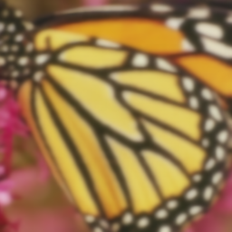
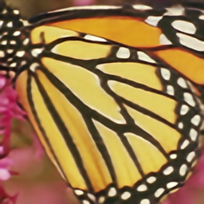
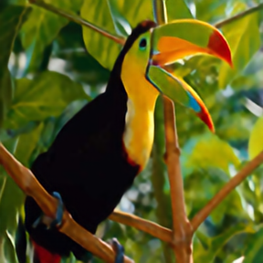
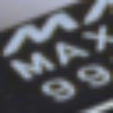
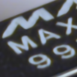
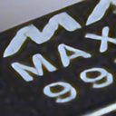

# Blind SR with Iterative Kernel Correction (CVPR2019)

> Original paper : [https://arxiv.org/abs/1904.03377](https://arxiv.org/abs/1904.03377)
> 
> Implementation of original author(s) : https://github.com/yuanjunchai/IKC
----

## Important ##
- There are no plans to update this repository.
- If you're looking for a good implementation of this paper, please see the original implementation.

### PSNR Comparison ###

| LR(x4)   | BICUBIC | EDSR | IKC(0) | IKC(7) | GroundTruth |
| -------------------- | ----- | ---- | ---- | ----- | ----- |
|  |  |  |   |   |  |
|  |  |  |   |   |  |
| - | 28.33 | 32.26 | - | 33.04 | - |

### Test on Real Image ###

| LR   | BICUBIC | EDSR | IKC
| --- | --- | --- | --- |
|  |  |  |  |
